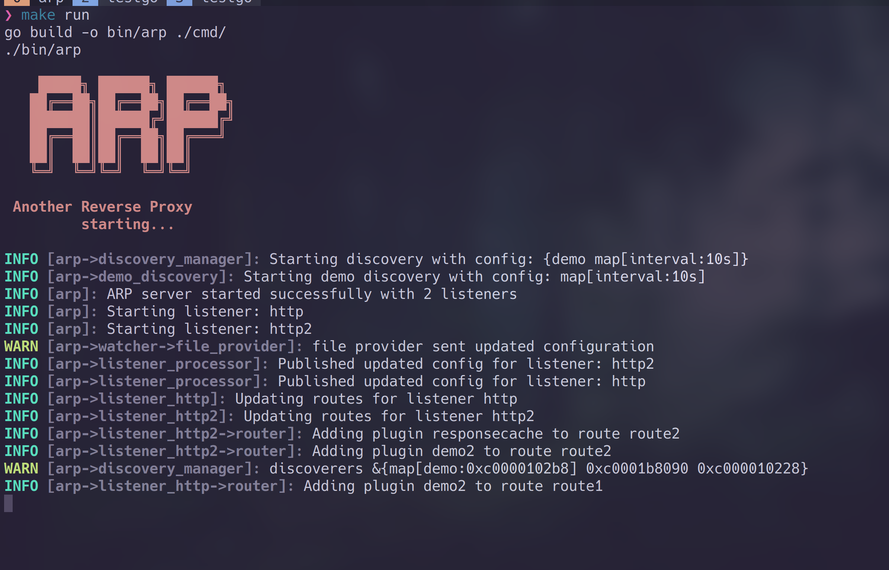
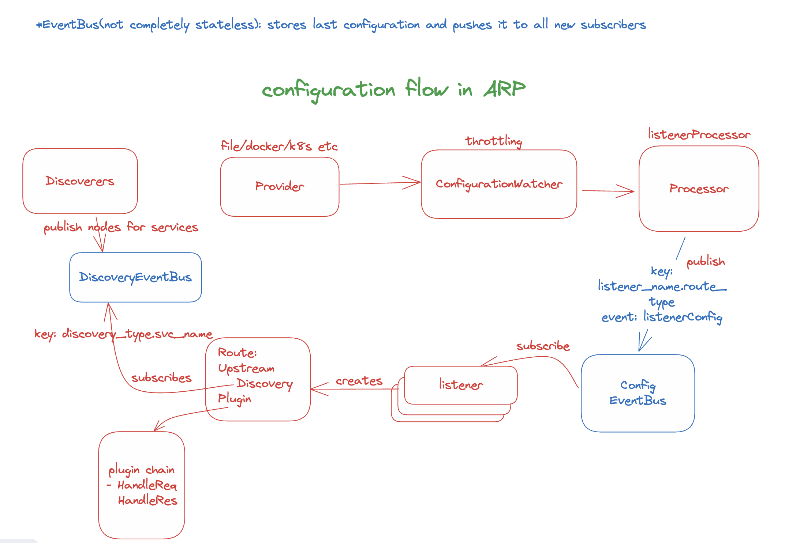

# ARP - Another Reverse Proxy

## Installation

```bash
VERSION=v0.1.1
wget https://github.com/Revolyssup/arp/releases/download/${VERSION}/arp-${VERSION}-linux-amd64
mv arp-v0.1.0-linux-amd64 ./arp
chmod +x ./arp
./arp
```





## Static configuration

```yaml
listeners:
  - name: http
    port: 8080
  - name: http2
    port: 8081

providers:
  - name: file
    type: file
    config:
      path: "./dynamic.yaml"
discovery:
  - type: demo
    config:
      interval: 10s
log_level: info
```

## Dynamic Configuration

```yaml
routes:
  - name: route1
    listener: http
    matches:
      - path: /headers
        headers:
          X-Demo: demo
    upstream:
      discovery:
        type: demo
      service: header
    plugins:
      - name: demo2
  - name: route2
    listener: http2
    matches:
      - path: /*
    upstream:
      name: backend2
    plugins:
      - name: responsecache
      - name: demo2
upstreams:
  - name: backend1
    nodes:
      - url: https://httpbin.org/headers
  - name: backend2
    nodes:
      - url: http://127.0.0.1:9090
      # - url: http://mockbin.org/headers
plugins:
  - name: responsecache
    type: responsecache
    config:
      ttl: 30
      key: uri
      size: 2
  - name: demo2
    type: demo
    config:
      message: "Hello from demo2 plugin!"

```

### Usage

```bash
ARP_CONFIG=./static.yaml ./arp
```

```bash
curl localhost:8080/
{
  "headers": {
    "Accept": "*/*",
    "Accept-Encoding": "gzip",
    "Host": "httpbin.org",
    "User-Agent": "curl/8.13.0",
    "X-Amzn-Trace-Id": "Root=1-68d02bee-7ada1053448207955dc981b6"
  }
}

```
